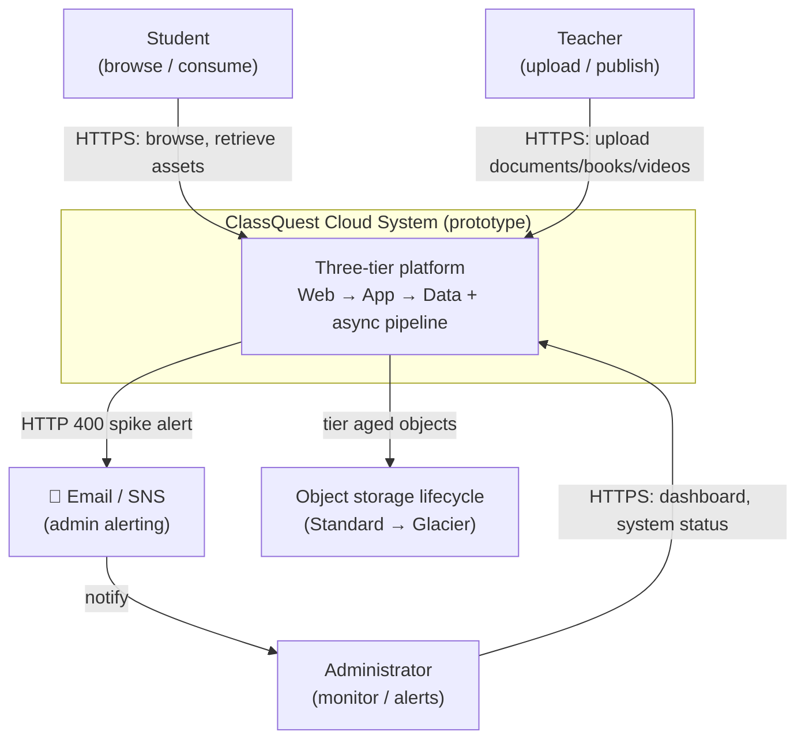
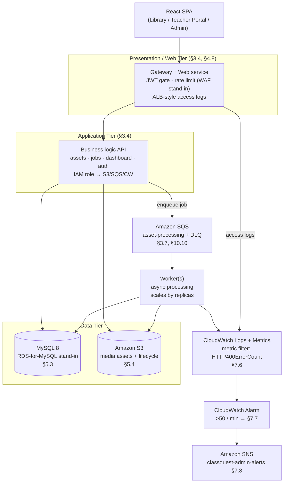
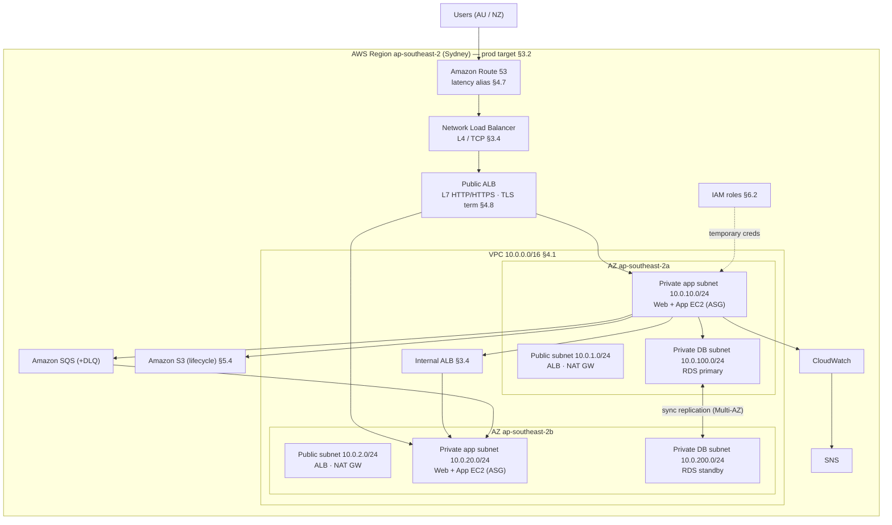
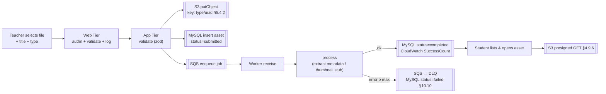
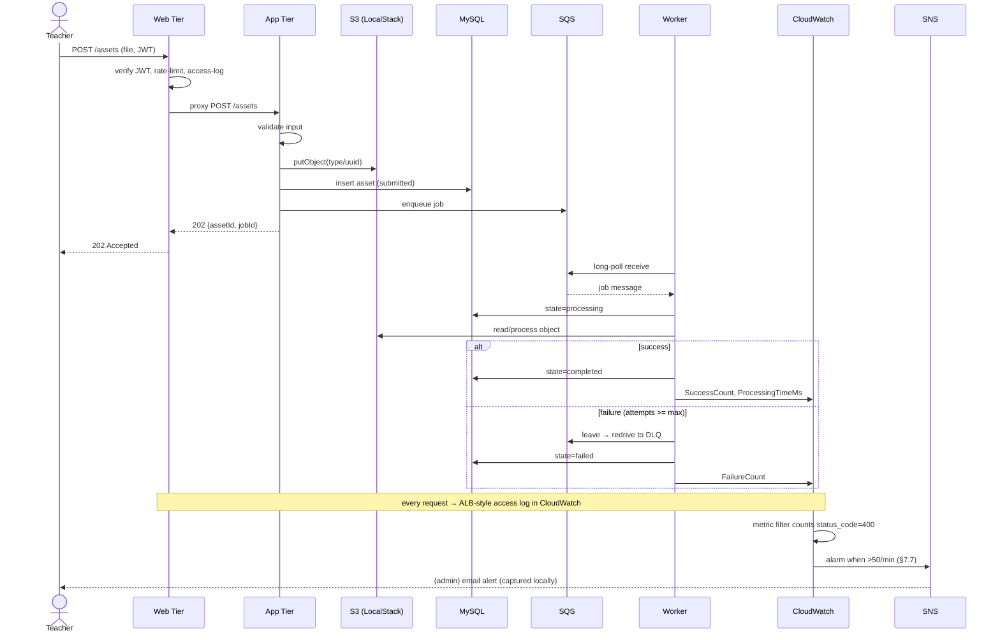
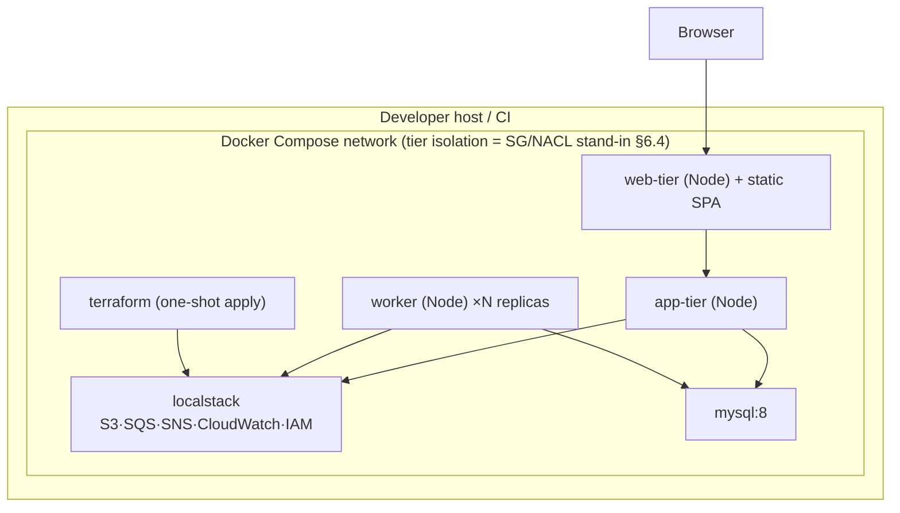

# ClassQuest Cloud Prototype — Architecture

> A research proof-of-concept realising the AWS cloud architecture from the INFS803 report
> _Cloud Solution Architecture Report — On-Premises to AWS Migration: ClassQuest_ (Evans & Bien,
> S2 2026). It runs the **real AWS service APIs on LocalStack**, so the architectural behaviour is
> exercised without an AWS account or cost. Section references (`§`) point into the source report.

---

## 1. System Overview

ClassQuest is a K-12 learning platform where **teachers publish** documents, digital books and
videos, and **students consume** them and track progress (`§1.2`). The source report proposes
migrating ClassQuest's legacy, single-points-of-failure, fixed-capacity three-tier on-premises
deployment to a highly available, elastic, secure AWS three-tier architecture (`§1.3`, `§3`).

This prototype demonstrates that architecture end-to-end: a decoupled **Web Tier → Application
Tier → Data Tier (MySQL + S3) with an asynchronous SQS processing pipeline**, credential-less IAM
access, lifecycle-tiered object storage, and CloudWatch→SNS monitoring (including the specific
"more than 50 HTTP 400 errors per minute" alert, `§2.2.8`).

---

## 2. Architectural Drivers

| Driver | Source | How the architecture responds |
|--------|--------|-------------------------------|
| Eliminate single points of failure | `§2.2.3` | Decoupled stateless tiers; multi-AZ design; RDS Multi-AZ; managed LB. |
| Handle school-schedule traffic spikes | `§2.2.4`, `§2.3.1` | Horizontally scalable tiers + async queue absorbing bursts. |
| Scale storage independently of compute | `§2.1.5`, `§2.3.4` | S3 object storage decoupled from EC2. |
| 5-year tiered retention | `§2.2.5`, `§5.4` | S3 lifecycle: Standard → Glacier @90d → expire @1825d. |
| Credential-less, least-privilege access | `§2.3.6`, `§6.2` | IAM roles per service; Web read-only, App read/write. |
| Alert on >50 HTTP 400 / min | `§2.2.8`, `§7.6` | CloudWatch Logs metric filter → alarm → SNS. |
| Reproducibility / IaC | `§2.7` | Terraform; one-command Docker Compose stack. |

---

## 3. System Context Diagram

---

## 4. Logical Architecture (three-tier, decoupled — §3.4)

---

## 5. Physical / Cloud Architecture (maps to §3.4, Figure 3)

**Prototype realisation:** the VPC/subnet/AZ/Route53/NLB/ALB/ASG layer is represented by Docker
Compose networking + an internal gateway and is fully described in Terraform for the `aws` target;
S3, SQS, SNS, CloudWatch and IAM run as **real APIs on LocalStack**; RDS is a MySQL 8 container.
See `README.md` §"Prototype vs Production fidelity".

---

## 6. Data Flow Diagram (upload → process → retrieve)

---

## 7. Sequence Diagram — primary end-to-end workflow (§3.7)

---

## 8. Deployment Diagram (prototype runtime — §11)

---

## 9. Component Descriptions

| Component | Responsibility | Report § |
|-----------|----------------|----------|
| `apps/frontend` | React SPA; role-based UI; dashboard. | §15 metrics |
| `services/web-tier` | Public entry; JWT gate; rate limit; proxy; ALB-style access logs. | §4.8, §6.11, §7.6 |
| `services/app-tier` | Business logic; S3/SQS/MySQL via IAM role; APIs; demo mode. | §3.4, §6.2 |
| `services/worker` | Async job processor; state machine; retry/DLQ; metrics. | §3.7, §10.10 |
| `packages/shared` | Cloud service clients, auth, domain, DB, logging. | §6, §7 |
| `infra/terraform` | S3/SQS/SNS/CloudWatch/IAM as code; dual targets. | §2.7, §3.9 |

---

## 10. Security Architecture (§6, NFR-5)

- **Human auth**: JWT (short expiry) + bcrypt + RBAC (`student`/`teacher`/`admin`).
- **Service auth**: IAM role assumption → temporary creds; **no static keys in code** (`§6.10`).
- **Least privilege**: Web role = `s3:GetObject` + `logs:PutLogEvents`; App role adds `s3:Put*`,
  `sqs:*` (scoped), `cloudwatch:PutMetricData` — mirrors `§2.3.6` web-read / app-write split.
- **Network isolation**: Compose private network; DB reachable only from app/worker (SG/NACL
  stand-in, `§6.4–§6.5`). Terraform models private subnets + tiered SGs for the `aws` target.
- **Input validation** (zod) + file type/size allow-list on every endpoint (`§13`).
- **Edge protection**: Web Tier rate limiting as WAF/Shield stand-in (`§6.11`).
- **Data protection**: S3 Block Public Access + presigned-URL-only retrieval (`§5.4.7`); SSE and
  TLS 1.3 documented for prod (`§6.8`, `§6.12`).
- **Sanitized errors**: client sees `{code,message,requestId}`; internals only in logs (`§6`).

---

## 11. Scalability & Elasticity Approach (§10.1–§10.2, NFR-2/3)

- Web/App/Worker are **stateless** → scale by replica count (EC2 ASG analogue).
- The **SQS queue decouples ingest from processing**, absorbing the 08:30 login/upload spike
  (`§2.2.4`); throughput scales by adding workers (demonstrated by `docker compose up --scale`).
- **S3** scales storage independently of compute (`§2.3.4`).
- Prod design uses target-tracking ASGs at 70% CPU (`§3.9.2`, `§5.1.8`) — documented, with the
  replica-scaling demonstration as the local analogue.

---

## 12. Availability & Reliability Approach (§10.3–§10.5, NFR-1/4)

- Multi-AZ design across `ap-southeast-2a/2b`; RDS Multi-AZ synchronous standby, <60s failover
  (`§5.3.4`). Prototype **simulates** failover (stop primary MySQL → documented recovery).
- Health checks isolate/replace unhealthy instances (`§5.1.6`); `/health` reports per-dependency.
- Retry + DLQ for processing failures (`§10.10`); versioned S3 guards against overwrite (`§5.4.6`).

---

## 13. Monitoring / Observability (§7, NFR-6)

- Structured JSON logs with `requestId`, tier, route, status, latency.
- Web Tier emits an **ALB-style access-log line per request** to CloudWatch Logs.
- Custom metrics: `RequestCount`, `SuccessCount`, `FailureCount`, `ProcessingTimeMs`, `QueueDepth`.
- **HTTP-400 pipeline** (the report's headline monitoring requirement): metric filter on
  `status_code=400` → `HTTP400ErrorCount` → alarm `>50`/min → SNS `classquest-admin-alerts`
  (`§7.6–§7.8`). Fully reproducible on LocalStack via the demo "400 burst" control.
- `/dashboard/metrics` aggregates real values (no decorative numbers — brief §20).

---

## 14. Failure Scenarios

| Scenario | Behaviour | Mechanism |
|----------|-----------|-----------|
| Worker crashes mid-job | Message visibility timeout expires → redelivered | SQS visibility timeout |
| Repeated processing failure | After 3 attempts → DLQ, asset `failed`, UI shows error | SQS redrive policy §10.10 |
| App Tier dependency down (S3/SQS/MySQL) | `503`, tier marked degraded | `/health` + error middleware |
| HTTP 400 spike (bad clients) | Alarm fires, SNS alert | CloudWatch metric filter + alarm §7.7 |
| AZ / DB primary failure | Failover to standby (simulated) | RDS Multi-AZ §5.3.4 (documented) |
| Invalid upload (type/size) | `400` with sanitized message, no S3 write | zod validation §13 |

---

## 15. Prototype Limitations (brief §4, §20; report §12.9)

1. RDS is a MySQL 8 container, not a managed Multi-AZ RDS instance; failover is simulated.
   The CloudWatch **metric filter and metric data are real** (the `>50 HTTP 400/min`
   breach is measured and recorded on LocalStack), but LocalStack **Community** does not
   run the alarm *evaluation* engine that transitions an alarm's `StateValue` to `ALARM`
   from metric data (that requires LocalStack Pro or real AWS). The alarm resource, metric
   filter, threshold and SNS wiring are all provisioned correctly; only the automatic
   state transition is unavailable locally.
2. Route 53 / NLB / ALB / Auto Scaling / VPC subnets / WAF / Shield are modelled in Terraform and
   behaviour, not provisioned as live AWS control-plane resources.
3. SNS email delivery is captured by LocalStack, not sent to a real inbox.
4. S3 Glacier retrieval latency (`§10.11`) is not emulated; tier transition is reported, not timed.
5. All learning content is synthetic sample data (labelled `DEMO/SAMPLE`); no real student data.
6. No real TLS/billing/DNS. See `RESEARCH_TRACEABILITY.md` for per-requirement status.
